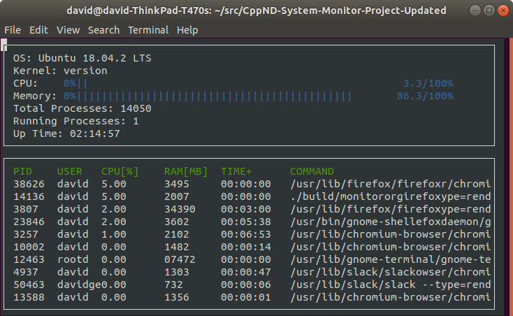

# C++ Linux System Monitor -

## About
The system monitor shows you what’s happening the computer: processes, id, CPU and memory usage. In this project, I wrote object-oriented C++ to build a Linux system monitor similar to the widely used htop application.

Install ncurses within your own Linux environment to run this project: `sudo apt install libncurses5-dev libncursesw5-dev`

## Instructions

1. Clone the project repository: `git clone git@github.com:AtharvaAnbhule/Linux-System-Monitor.git`

2. Build the project: `make build`

3. Run the resulting executable: `./build/monitor`
